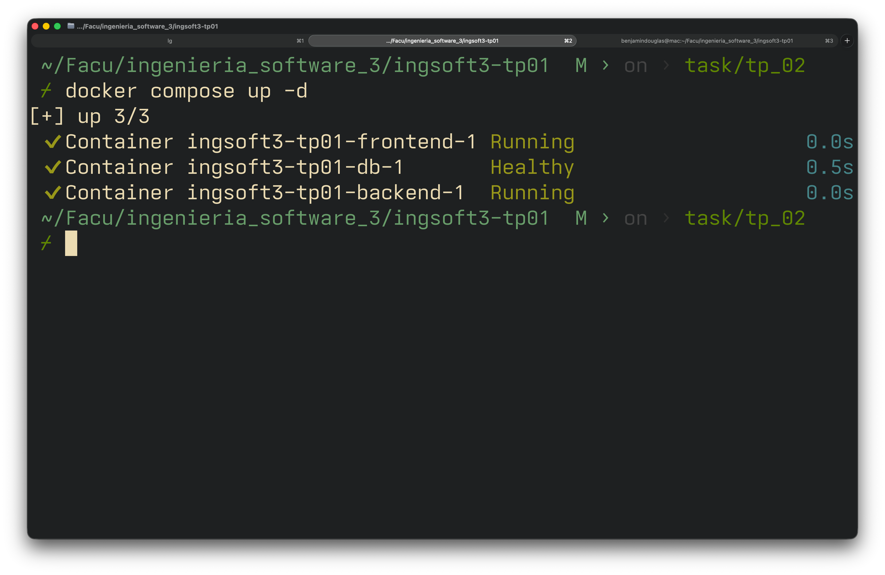
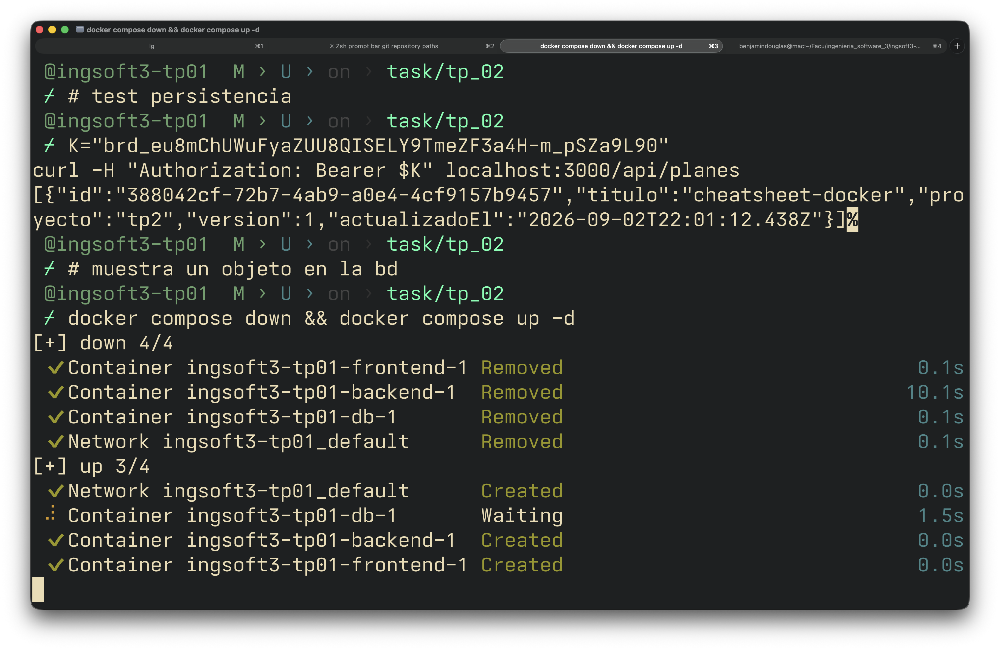
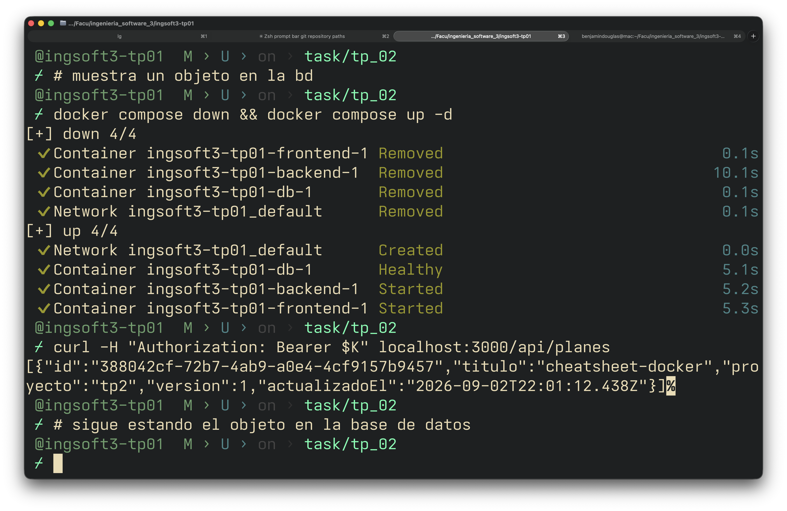
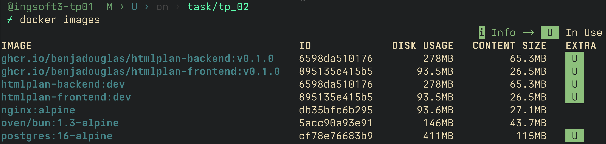
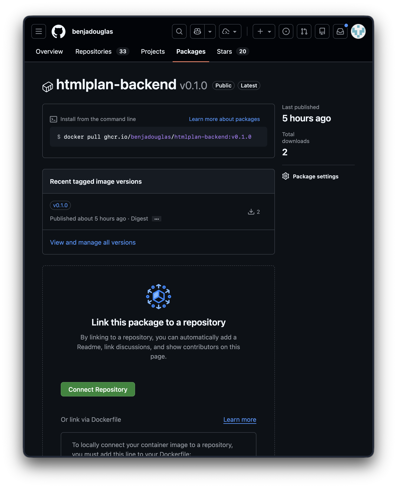
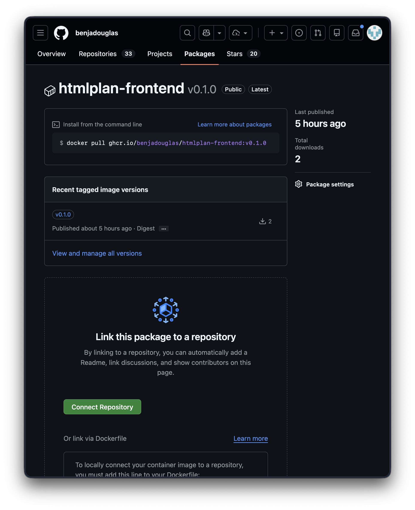

# Evidencias — TP1

## 1. Push directo a main rechazado

GitHub rechaza el push porque main está protegida y la regla alcanza también al dueño del repo.

## 2. Conflicto de merge

Github marca el merge conflicto

## 3. Resolución merge

Github muestra los conflictos para resolverlos

## 4. Release

Tag y release

# Evidencias - TP2

## 1. docker compose up -d

## 2. Datos persisten en la base de datos

## 3. Tamaño imagen final vs sdk

Fijarse en el tamaño de htmlplan-backend:dev y htmlplan-frontend:dev, comparado a oven/bun:1.3-alpine

## 4 Package publicado

- [link](https://github.com/users/benjadouglas/packages/container/package/htmlplan-backend)

- [link](https://github.com/users/benjadouglas/packages/container/package/htmlplan-frontend)

