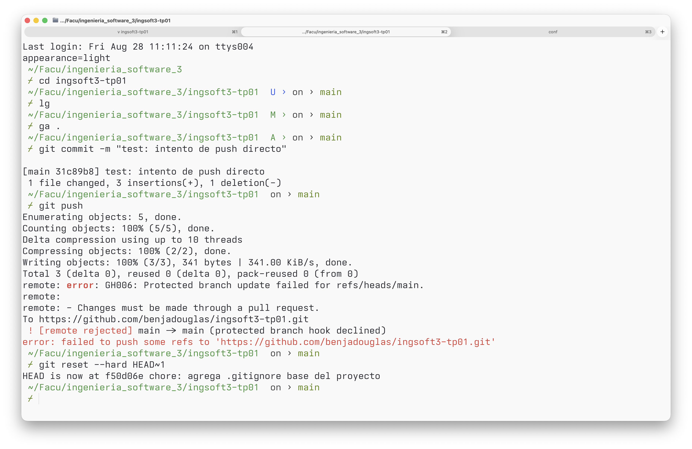
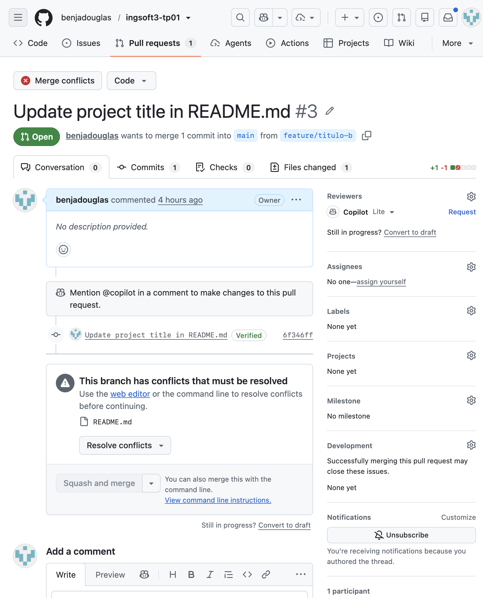
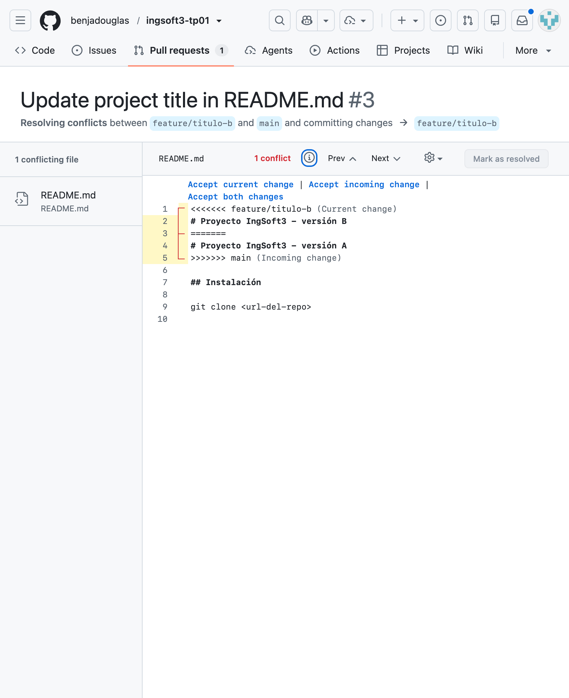
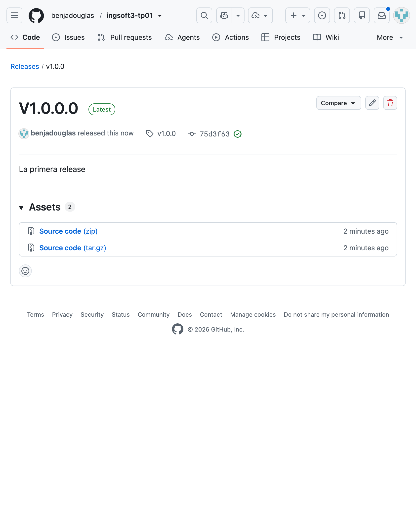

# Evidencias — TP1

## 1. Push directo a main rechazado

GitHub rechaza el push porque main está protegida y la regla alcanza también al dueño del repo.

## 2. Conflicto de merge

Github marca el merge conflicto

## 3. Resolución merge

Github muestra los conflictos para resolverlos

## 4. Release

Tag y release

